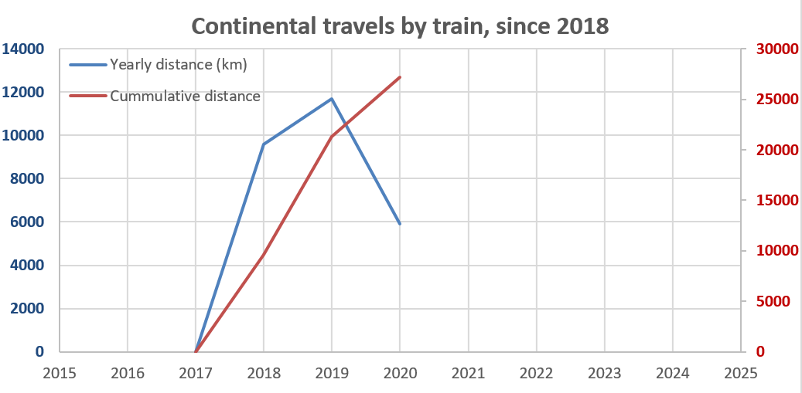
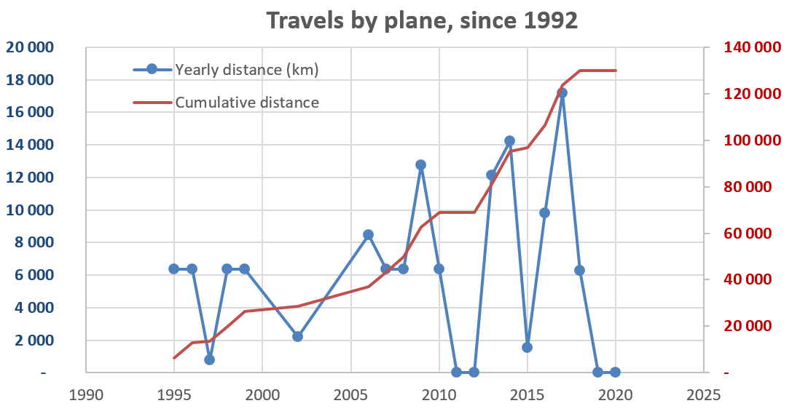

Title: Continental travels by train
Date: 2020-08-31 08:00
Modified: 2020-08-310 08:00
Category: sustainability
Tags: climate, energy, travels, train
Slug: train-travel
Authors: Elias
Status: published

## Background
In 2018, I took up the challenge of limiting my use of airplanes to 1 travel per year and to do all my intracontinental travels in Europe by train. This 1-per-year quota was thought for travels from Europe to Lebanon, to visit the family I have there. My last flight to Lebanon was in 2018-03 for work and family visit. Scheduled flights there in 2019 & 2020 are for sure postponed due to on-going revolution & pandemic...

Over the period 2018-2020, I travelled from Stockholm to various places in Europe, for both work and family visits. This included: Paris, Aix-en-Provence (France), Cetraro (Italy, work), Düsseldorf, Bremen (Germany), Nijmegen (Netherlands, work). I have used both InterRail cards and direct bookings. 

All these train travels  (27 200 km, cummulate) have been memorable experiences: view on lakes & the Alps when crossing Switzerland, dinner in Milano and waking up at the beach in Cetraro, taking the ferry from Sweden to Germany... 

Below, I compile information that may be useful to others:

## With an InterRail cards... 

Main advantage: a flexible trip, as you don't need seat reservations for all trains
Economic: good if you plan a long trip with stops in various places, and if you plan to cross Germany a lot (nearly all trains are without reservation)

The key: know how to book your compulsory seat reservations!
- Which trains have a compulsory seat reservation: check it here https://www.interrail.eu/en/plan-your-trip/interrail-timetable 
- Book SJ seats (72SEK on SJ Snabbtåg STO-MAL): https://www.sj.se/en/home.html (Note: you need to use the English version of the website, and select InterRail in the options)
- Book Dutch seats (typically EC train between CPH & HAM): https://travel.b-europe.com/dsb-rail/en/reservation-only 
- Book French TGV seats: done once at a train station in Paris, the staff even managed to book for us until Frankfurt actually (without fee); alternative is to use the SNCF website, but at the time it did not work with the French website, I had to go through either UK, CH or BE pages e.g. https://ch.oui.sncf/fr/pass/reservation-siege or https://be.oui.sncf/fr/pass/seat-reservation or https://en.oui.sncf/en/pass/seat-reservation 
- Italian express trains: via Tourist Office in Stockholm Central or last resort, online on ~~shitty~~ InterRail website (with fees in both cases)

Planning tip: if you want to go to from Paris to Stockholm, and type this directly in the rail planner (link) you probably will get routes that are impossible to do. Adapt & adjust! Use the feature "minimum connection time". Target the key fast trains or night trains you want to take, where you want to have dinner, and adjust the other trains around it to have a pleasant journey.

Ah, where to get the InterRail card? 
- option 1) online https://www.interrail.eu/, it will be sent to you by plane from Ireland... 
- option 2) at the Tourist Office in Stockholm Central station (with a fee + weird opening times)

## With direct train bookings...

Main websites for booking:
- SE: https://www.sj.se/
- DK/DE: https://www.bahn.de/ Pro tip: you can book Malmö-Hamburg (crossing 3 countries) directly on one website
- DK (international trains, typically CPH-HAM): https://travel.b-europe.com/dsb-rail/dk/booking 
- FR: https://www.oui.sncf/

Tip: Malmö to anywhere in Germany can be done in a single booking: https://www.bahn.de/

## Examples of train routes

List of (some) train routes I made... I usually split my travels to be able to visit family on the way (spread around Bremen, Dusseldorf & Paris - very convenient indeed, but you may have friends here & there as well?). I also made direct journeys without stops (e.g Paris to Stockholm & Stockholm to Cetraro without stopping on the way, and luckily every train was on time or even early).

- Stockholm - Kirchweyghe (visiting Sister), then continuing to Paris
    - STO > MAL : night train, 40€
    - MAL > CPH > HAM > BRE > KIRCH : 50€, booked in one shot via DB website
    - KIRCH > DUS: 2 regional trains, 20€
    - DUS > PARIS: via Thalys, 50€

- Stockholm to Düsseldorf
    - STO > CPH: SJ express train
    - CPH > HAM: direct EC train (or without seat reservation) 2 regional train with change in Fredericia
    - HAM > DUS: direct express trains without (seat reservation)
    - bonus: DUS > PAR: take the Thalys, also departs from Cologne

- Stockholm to Cetraro, in the South of Italy, 40 hours of travel with my boss, for an academic conference, via InterRail, and just 5 trains!
    - STO > CPH: afternoon train, dinner in Copenhague
    - CPH > HAM: night train without sleeper
    - HAM > ZUR: express train crossing Germany, without seat reservation
    - ZUR > MIL: express train with with seat reservation, dinner in a pizzeria before boarding night train
    - MIL > CETRARO: night train, with sleeper, waking up with view on the sea

- Paris to Stockholm, without stop, with InterRail, and just 4 trains!
    - PARIS > FRANKFURT: afternoon train, TGV
    - FRANKFURT > HAMBURG: express train, by night, without sleeper, without seat reservation
    - HAMBURG > CPH: EC direct train, with seat reservation
    - CPH > STO: SJ express train, arriving in early evening

## Complete list of train routes

| Year | Date       | IR/D | Path                                                              | Distance (km) | Cummulative train travels (km) |
|------|------------|------|-------------------------------------------------------------------|---------------|--------------------------------|
| 2020 | 2020-09-03 | D    | STO>MAL>CPH>HAM>BRE>KIR + DUS>PAR + PAR>DUS>HAM>CPH>STO           | 3400          |          27 200                |
| 2020 | 2020-05-25 | D    | STO>MAK>ferry:TRL>LUB>HAM>BRE>KIR + DUS>OSN>KIR>BRE>HAM>CPH>STO   | 2500          |          23 800                |
| 2019 | 2019-12-20 | IR5  | STO>DUS>AMS>HAR>AMS>CPH>STO                                       | 3000          |          21 300                |
| 2019 | 2019-09-13 | IR4  | STO>ITL>DUS>PAR>BRM>STO                                           | 6700          |          18 300                |
| 2019 | 2019-02-15 | D    | STO>KIR>STO                                                       | 2000          |          11 600                |
| 2018 | 2018-12-20 | IR3  | STO>BRM>DUS>WAG>STO                                               | 2900          |            9 600               |
| 2018 | 2018-08-20 | IR2  | STO>NIJ>VNL>NIJ>DUS>BRM>STO                                       | 2900          |            6 700               |
| 2018 | 2018-06-20 | IR1  | STO>BRM>DUS>PAR>SUT>HAM>STO                                       | 3800          |            3 800               |

## Graphs

